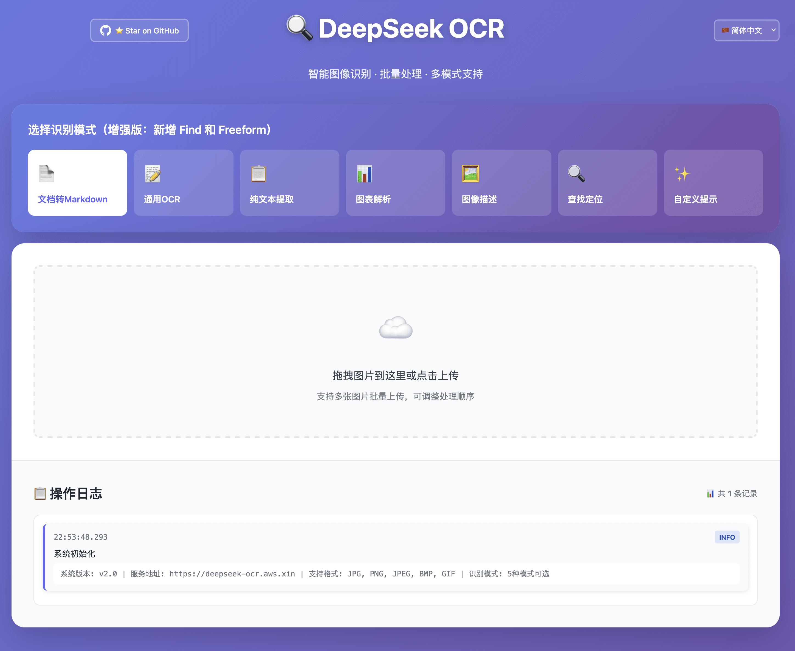

# 🚀 GitHub 推送成功总结

## ✅ 推送完成

**提交哈希**: `1dbb211`  
**提交信息**: ✨ v3.1 重大更新：多语言支持 + Find 模式 + UI 优化  
**推送时间**: 2025-10-22  
**目标仓库**: https://github.com/neosun100/DeepSeek-OCR-WebUI  
**分支**: main

---

## 📦 已推送的文件

### 新增文件 (15个)

**配置文件**:
- ✅ `.dockerignore` - Docker 忽略文件
- ✅ `Dockerfile` - Docker 镜像构建
- ✅ `docker-compose.yml` - Docker Compose 配置
- ✅ `i18n.js` - 多语言支持模块

**文档文件**:
- ✅ `CHANGELOG.md` - 完整版本历史
- ✅ `QUICK_START.md` - 快速开始指南
- ✅ `ENHANCED_FEATURES.md` - 增强功能说明
- ✅ `FIND_MODE_V2_GUIDE.md` - Find 模式详解
- ✅ `BUGFIX_SUMMARY.md` - Bug 修复总结
- ✅ `DEPLOYMENT_SUMMARY.md` - 部署总结
- ✅ `I18N_IMPLEMENTATION.md` - 多语言实现文档
- ✅ `I18N_TEST_GUIDE.md` - 多语言测试指南
- ✅ `GITHUB_INTEGRATION.md` - GitHub 推广集成文档

**资源文件**:
- ✅ `assets/ui_screenshot.png` - **新版 UI 界面截图** 🎨
- ✅ `assets/qrcode_promo.png` - 推广二维码

### 修改文件 (3个)

- ✅ `README.md` - 添加 UI 预览，完善文档
- ✅ `ocr_ui_modern.html` - 多语言支持 + Find 模式
- ✅ `web_service.py` - transformers 引擎 + API 增强

---

## 📊 更新统计

```
18 files changed
6,863 insertions(+)
1,352 deletions(-)

新增文件: 15 个
修改文件: 3 个
总代码行: +5,511 行
```

---

## 🌟 本次更新亮点

### 1. 🖼️ 新版 UI 界面展示

**新增截图**: `assets/ui_screenshot.png`
- 📐 尺寸: 2898 x 2374 像素
- 📦 大小: 516KB
- 🎨 内容: 展示多语言界面、Find 模式、批量处理

**README 更新**:
```markdown
### 🖼️ UI 预览



**现代化的用户界面，支持多语言切换、批量处理、边界框可视化**
```

### 2. 🌐 多语言支持

**功能**:
- ✅ 4 种语言完整支持
- ✅ 实时切换无需刷新
- ✅ LocalStorage 持久化
- ✅ UI 100% 本地化

**实现**:
- `i18n.js` - 翻译字典和切换逻辑
- `ocr_ui_modern.html` - 集成多语言模块
- `I18N_IMPLEMENTATION.md` - 技术文档

### 3. 🔍 Find 模式

**特性**:
- ✅ 左右分栏专用布局
- ✅ Canvas 边界框可视化
- ✅ 6 种彩色霓虹标注
- ✅ 响应式自动重绘

**文档**:
- `FIND_MODE_V2_GUIDE.md` - 详细使用指南

### 4. 🐳 Docker 支持

**文件**:
- `Dockerfile` - 容器构建配置
- `docker-compose.yml` - 服务编排
- `.dockerignore` - 构建优化

**特性**:
- ✅ GPU 加速
- ✅ 健康检查
- ✅ 自动重启
- ✅ 一键部署

### 5. 📚 文档完善

**新增 9+ 文档**:
- ✅ CHANGELOG.md - 版本历史
- ✅ QUICK_START.md - 快速入门
- ✅ ENHANCED_FEATURES.md - 功能说明
- ✅ BUGFIX_SUMMARY.md - 问题修复
- ✅ 还有更多...

**覆盖内容**:
- 🚀 快速开始
- 📖 功能详解
- 🐛 故障排查
- 🔧 技术实现
- 🌐 国际化
- 🎯 使用示例

---

## 🎯 GitHub 仓库状态

### 仓库信息

**URL**: https://github.com/neosun100/DeepSeek-OCR-WebUI  
**分支**: main  
**最新提交**: 1dbb211  
**版本**: v3.1

### 项目特性徽章

在 README 中已添加：
```markdown
[](./CHANGELOG.md)
[](./docker-compose.yml)
[](./LICENSE)
[](#多语言支持)
```

### 文档结构

```
DeepSeek-OCR-WebUI/
├── README.md                    ⭐ 主文档（已更新）
├── CHANGELOG.md                 📝 版本历史
├── QUICK_START.md               🚀 快速开始
├── ENHANCED_FEATURES.md         ✨ 功能说明
├── FIND_MODE_V2_GUIDE.md        🔍 Find 模式
├── BUGFIX_SUMMARY.md            🐛 Bug 修复
├── DEPLOYMENT_SUMMARY.md        🐳 部署总结
├── I18N_IMPLEMENTATION.md       🌐 多语言实现
├── I18N_TEST_GUIDE.md           🧪 多语言测试
├── GITHUB_INTEGRATION.md        ⭐ GitHub 集成
├── Dockerfile                   🐳 Docker 构建
├── docker-compose.yml           🐳 Docker 编排
├── .dockerignore                🐳 Docker 优化
├── i18n.js                      🌐 多语言模块
├── ocr_ui_modern.html          🎨 前端 UI
├── web_service.py              ⚙️ 后端服务
└── assets/
    ├── ui_screenshot.png       🖼️ UI 截图（新）
    └── qrcode_promo.png        📱 推广二维码
```

---

## 🔗 访问链接

### GitHub 仓库
**主页**: https://github.com/neosun100/DeepSeek-OCR-WebUI

### 在线查看
- **README**: https://github.com/neosun100/DeepSeek-OCR-WebUI/blob/main/README.md
- **UI 截图**: https://github.com/neosun100/DeepSeek-OCR-WebUI/blob/main/assets/ui_screenshot.png
- **更新日志**: https://github.com/neosun100/DeepSeek-OCR-WebUI/blob/main/CHANGELOG.md

### 快捷链接
- **Issues**: https://github.com/neosun100/DeepSeek-OCR-WebUI/issues
- **Pull Requests**: https://github.com/neosun100/DeepSeek-OCR-WebUI/pulls
- **Releases**: https://github.com/neosun100/DeepSeek-OCR-WebUI/releases
- **Wiki**: https://github.com/neosun100/DeepSeek-OCR-WebUI/wiki

---

## ✅ 验证清单

推送成功后，请验证以下内容：

### GitHub 网页端验证

- [ ] 访问仓库首页，查看更新时间
- [ ] 查看 README.md 中的 UI 截图是否正常显示
- [ ] 检查所有新增文档是否可访问
- [ ] 验证徽章链接是否正常
- [ ] 查看提交历史和更新说明

### 文件验证

- [ ] `assets/ui_screenshot.png` - UI 截图显示正常
- [ ] `assets/qrcode_promo.png` - 推广二维码显示正常
- [ ] `CHANGELOG.md` - 版本历史完整
- [ ] `README.md` - UI 预览章节存在
- [ ] 其他文档文件可正常访问

### 功能验证

- [ ] 克隆仓库测试
- [ ] Docker 构建测试
- [ ] 文档链接跳转测试
- [ ] 图片显示测试

---

## 🎊 下一步建议

### 1. 创建 Release

建议创建 v3.1 正式发布：
```bash
# 方式 1: GitHub 网页端
访问: https://github.com/neosun100/DeepSeek-OCR-WebUI/releases/new
Tag: v3.1
Title: v3.1 - 多语言支持与 Find 模式
Description: 参考 CHANGELOG.md

# 方式 2: 使用 gh CLI
gh release create v3.1 \
  --title "v3.1 - 多语言支持与 Find 模式" \
  --notes-file CHANGELOG.md
```

### 2. 添加其他语言 README

计划中的文档：
- [ ] `README_zh-TW.md` - 繁體中文
- [ ] `README_en.md` - English
- [ ] `README_ja.md` - 日本語

### 3. 完善 GitHub 配置

建议添加：
- [ ] `.github/ISSUE_TEMPLATE/` - Issue 模板
- [ ] `.github/PULL_REQUEST_TEMPLATE.md` - PR 模板
- [ ] `.github/workflows/` - CI/CD 工作流
- [ ] `CONTRIBUTING.md` - 贡献指南
- [ ] `LICENSE` - 开源协议

### 4. 社区推广

- [ ] 在社交媒体分享
- [ ] 写博客介绍项目
- [ ] 录制演示视频
- [ ] 提交到 Awesome 列表

---

## 📝 提交详情

### 完整提交信息

```
✨ v3.1 重大更新：多语言支持 + Find 模式 + UI 优化

🌐 多语言支持
• 新增 4 种语言：简体中文、繁體中文、English、日本語
• 实时语言切换，无需刷新页面
• 设置持久化保存（LocalStorage）
• UI 100% 本地化覆盖
• 新增 i18n.js 多语言模块

🔍 Find 模式（查找定位）
• 全新左右分栏布局
• Canvas 边界框可视化
• 6 种彩色霓虹标注效果
• 精确坐标转换和定位
• 响应式自动重绘

🎨 UI 优化
• 新增项目 UI 截图展示
• 渐变背景 + 玻璃态设计
• GitHub Star 推广集成
• 模式选择器始终可见
• 边界框精确对齐图片

🐛 Bug 修复
• 修复 CUDA 库兼容性问题
• 修复图片读取错误
• 修复模式切换无法返回
• 修复边界框超出边界
• 修复多语言切换不生效

🐳 Docker 支持
• 完整的 Docker 容器化
• GPU 加速配置
• 健康检查和自动重启
• 一键部署

📚 文档完善
• 新增 9+ 详细文档
• CHANGELOG.md 完整版本历史
• QUICK_START.md 快速入门
• FIND_MODE_V2_GUIDE.md 功能详解
• I18N_IMPLEMENTATION.md 技术实现
• BUGFIX_SUMMARY.md 问题修复
• 更多...

🔧 技术改进
• 切换到 transformers 引擎（更稳定）
• 优化后端 API（支持 Find/Freeform）
• 前端性能优化
• 响应式设计完善
```

---

## 🎉 推送成功！

**所有更新已成功推送到 GitHub！**

现在你可以：
1. 访问仓库查看更新：https://github.com/neosun100/DeepSeek-OCR-WebUI
2. 查看新的 UI 截图展示
3. 浏览完善的文档
4. 创建 v3.1 Release
5. 分享给更多用户

---

<div align="center">

**🌟 感谢使用 DeepSeek-OCR-WebUI！🌟**

如果项目对你有帮助，请给一个 Star ⭐

[⭐ Star on GitHub](https://github.com/neosun100/DeepSeek-OCR-WebUI) | 
[🐛 Report Issue](https://github.com/neosun100/DeepSeek-OCR-WebUI/issues) | 
[📖 Documentation](https://github.com/neosun100/DeepSeek-OCR-WebUI/wiki)

Made with ❤️ by [@neosun100](https://github.com/neosun100)

</div>
